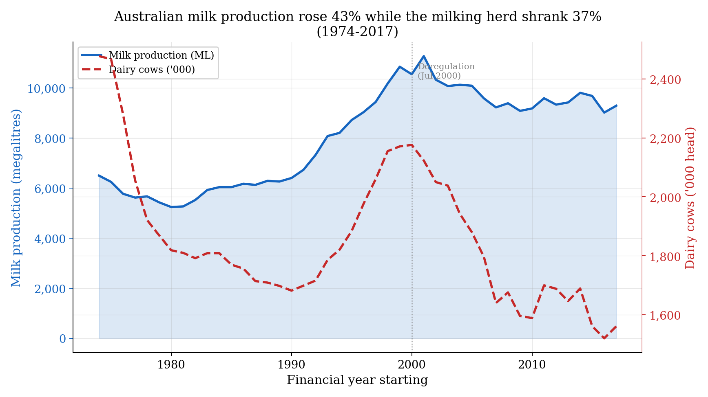
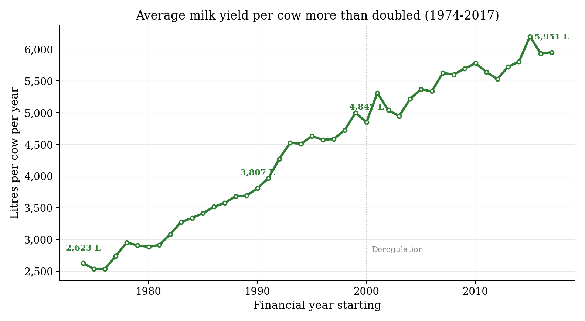
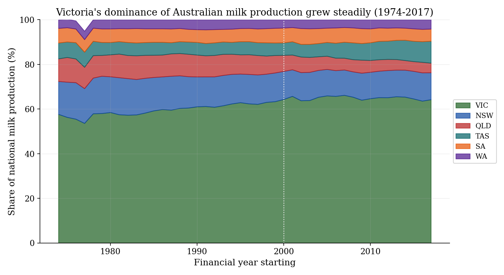
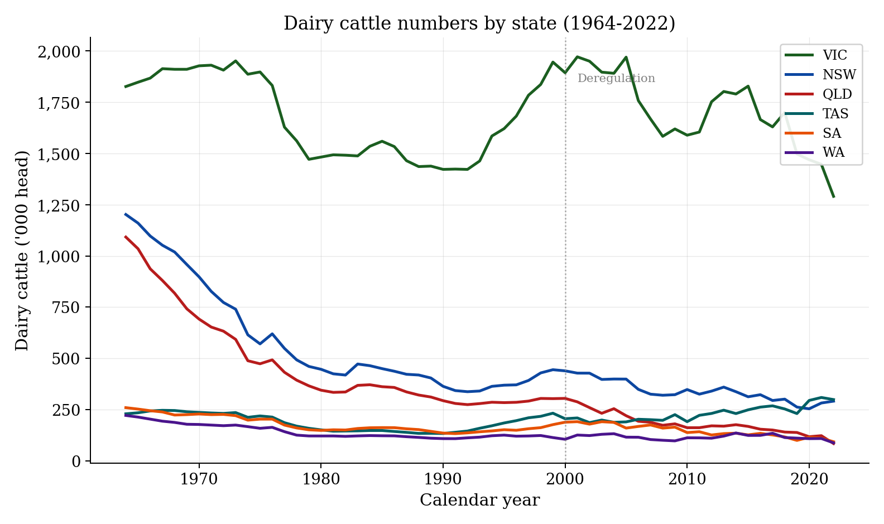
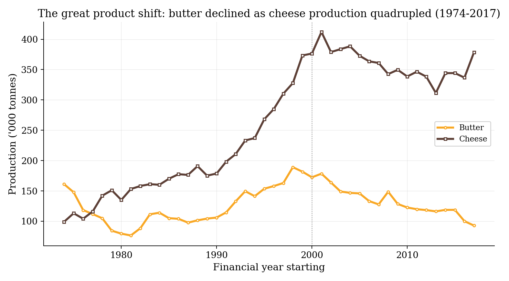
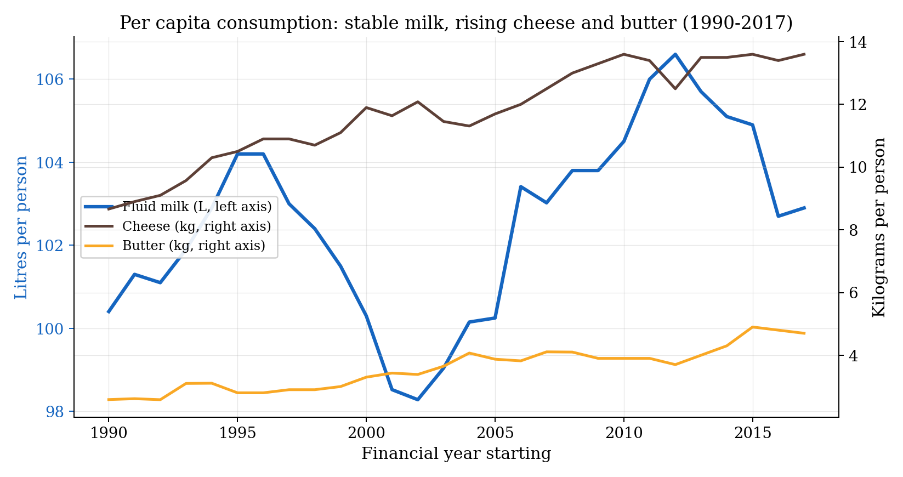
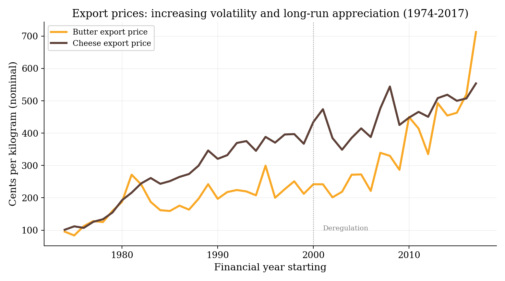
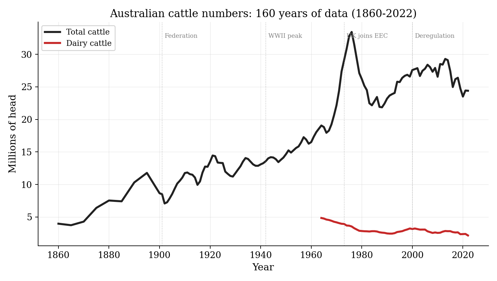

# Australian Dairy Industry Historical Statistics (1860-2022)

A compiled dataset of Australian dairy industry statistics drawn from official government sources, covering production, prices, herd demographics, and consumption.



## The dataset

**2,703 observations** across **17 variables**, **9 geographic units** (6 states, 2 territories, national), spanning **1860-2022**.

The final dataset is a single tidy CSV at [`data/final/aus_dairy_stats.csv`](data/final/aus_dairy_stats.csv).

### Variables

| Category | Variable | Unit | Years | States |
|----------|----------|------|-------|--------|
| **Herd** | Total cattle | head | 1860-2022 | All |
| | Dairy cattle | head | 1964-2022 | All |
| | Dairy cows (milking herd) | head | 1974-2017 | 6 states + AUS |
| | Yield per cow | litres | 1974-2017 | AUS |
| **Production** | Milk (total) | megalitres | 1974-2017 | 6 states + AUS |
| | Butter | tonnes | 1974-2017 | AUS |
| | Cheese | tonnes | 1974-2017 | AUS |
| | Milk powder | tonnes | 1990-2017 | AUS |
| **Price** | Farmgate avg | c/L | 1974-2017 | AUS |
| | Farmgate manufacturing | c/L | 1974-1999 | AUS |
| | Farmgate market (liquid) | c/L | 1974-1999 | AUS |
| | Export butter | c/kg | 1974-2017 | AUS |
| | Export cheese | c/kg | 1974-2017 | AUS |
| **Consumption** | Milk per capita | litres | 1990-2017 | AUS |
| | Butter per capita | kg | 1990-2017 | AUS |
| | Cheese per capita | kg | 1990-2017 | AUS |
| | Total domestic milk | megalitres | 1990-2017 | AUS |

### Sources

- **ABARES Agricultural Commodity Statistics 2018** -- dairy tables 6.1-6.9 (production, prices, herd, consumption, trade). Financial year data from 1974-75.
- **ABS Historical Selected Agricultural Commodities (1860-2022)** -- cattle numbers by state. Calendar year data from 1860.

## Key trends

The dataset documents five major structural transformations in Australian dairy:

**1. Herd contraction, production growth.** The milking herd shrank 37% (2.5M to 1.6M cows) while milk output rose 43% (6,500 to 9,300 ML), driven by a 127% increase in yield per cow.

**2. Geographic concentration.** Victoria's share of national production grew from 58% (1974) to 64% (2017). Queensland collapsed from 23% to 4% of the national dairy herd.

**3. Deregulation (July 2000).** The end of the two-price system eliminated the market milk premium, exposed farmers to global price volatility, and accelerated farm exit.

**4. Product shift.** Butter production halved; cheese quadrupled. Per capita cheese consumption rose from 8.7 to 13.6 kg (1990-2017).

**5. Price volatility.** Post-deregulation farmgate prices swung between 27 and 51 c/L, compared with the steadier 24-31 c/L range of the 1990s.

## Charts

All figures are in [`paper/figures/`](paper/figures/).

| | |
|:---:|:---:|
|  |  |
|  |  |
|  |  |
|  |  |

## Reproducing the dataset

Requires Python 3.10+ with pandas, openpyxl, duckdb, numpy, and matplotlib.

```bash
# 1. Download raw data from ABARES and ABS
python scripts/download_abares.py
python scripts/download_abs.py

# 2. Parse sources and load into DuckDB
python scripts/ingest.py

# 3. Generate charts
python scripts/charts.py
```

The pipeline downloads raw Excel files into `data/raw/`, parses them into a DuckDB database at `data/dairy_stats.duckdb`, and exports the final CSV to `data/final/aus_dairy_stats.csv`.

## Project structure

```
aus-dairy-stats/
  data/
    final/aus_dairy_stats.csv    # The compiled dataset
    raw/                         # Downloaded source files (not in git)
  paper/
    data_descriptor.md           # Research paper with trend analysis
    figures/                     # 9 publication-quality charts
  scripts/
    download_abares.py           # Download ABARES source files
    download_abs.py              # Download ABS source files
    parse_abares_dairy.py        # Parse ABARES ACS dairy tables
    parse_abs_historic.py        # Parse ABS historic cattle data
    ingest.py                    # Master pipeline: parse + load DB
    db.py                        # DuckDB database management
    schema.sql                   # Database schema (SQLite reference)
    conversions.py               # Unit conversion utilities
    charts.py                    # Generate all figures
```

## Research paper

The full data descriptor and trend analysis is at [`paper/data_descriptor.md`](paper/data_descriptor.md). It discusses:

- Herd contraction and geographic concentration
- The productivity revolution in per-cow yields
- Farmgate pricing under regulation and deregulation
- The shift from butter to cheese and powder
- Structural adjustment and its social consequences
- Environmental pressures and the Millennium Drought

Drawing on agricultural economics (Edwards 2003; Sheng et al. 2020; Nossal & Sheng 2010) and rural sociology (Alston 1995, 2000; Cocklin & Dibden 2002; Hu 2021) literatures.

## License

The compiled dataset is derived from Australian Government open data (ABS and ABARES). Code in this repository is available under the MIT License.
